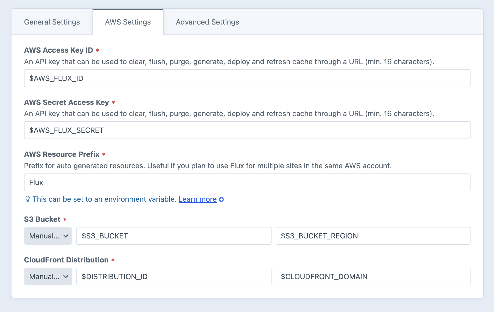

# Basic Setup

Flux aims to make it easy to set up and maintain the AWS resources related to processing and serving image transforms. After initially installing Flux you will be presented with a setup wizard guiding you through preparing your Amazon Web Services account. You can rerun the wizard by selecting **Run Setup Wizard** at the top right of the Flux settings page.

## Setup Wizard

The easiest way to get started is by following the **Setup Wizard**. At the appropriate point in the wizard you are required to create or enter the name of an S3 bucket to store your transformed assets, as well as creating a CloudFront distribution to serve them. When you have entered these details and click **Test Connection**, Flux will attempt to use the details to fetch the S3 bucket region and CloudFront endpoint, in doing so testing everything is ready to go.

Once the wizard is complete, Flux is not yet installed. You are prompted whether to install immediately or to do this later, perhaps when deploying your site.

## Manual Requirements

In order to function, Flux requires an AWS account with:

1. S3 Bucket for storing assets. If your site already uses S3 for your asset filesystem, this can be the same bucket
2. CloudFront distribution pointed at the S3 bucket from the previous step
3. IAM User configured with the policy found in Utilities → Flux → IAM Policy

It is recommended to use environment variables to store the details for the above resources. You configuration may look similar to the screenshot below. Once configured, run Utilities → Flux → **Install / Update to AWS** to have Flux automatically create all required resources within your AWS account. They will be prefixed with the resource prefix. If you will be using Flux for multiple sites with the same AWS account, please configure this to something specific in order to prevent conflict.

