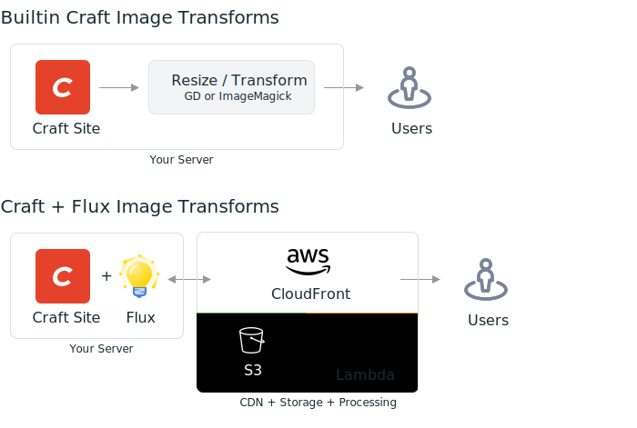

 

 

# Flux Plugin for Craft CMS

Flux integrates your site image transforms with AWS, using Lambda and CloudFront to process, cache and serve your images.

- Image heavy pages will feel more instantaneous to load because high performance CloudFront servers perform the image transformations
- Process image transforms on demand, only when they are requested by the user
- Automatically serve WebP to browsers that support it without having to explicitly define WebP transforms in your templates
- Supports all Craft filesystems, including local folders
- Compatible with your existing Craft template code and named transforms. Simply enable Flux and your templates don't need to change
- Transforms are completely URL based, no database queries are needed
- Automatically purge and invalidate CloudFront when assets change

 

