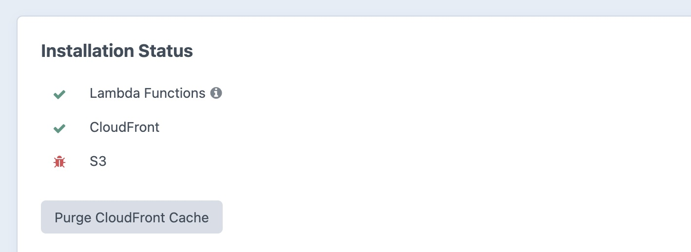
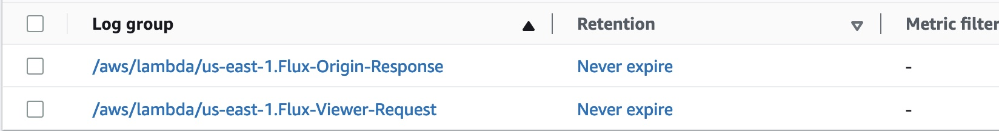

# Troubleshooting

If you've ever used AWS, you know how complex it can become. Flux aims to help as much as possible, however with so many settings, permissions and account variations, sometimes things won't go according to plan. If you experience issue, below are things you can do to investigate and find a solution yourself, or to get more information for when you [submit an issue](https://github.com/dyerc/craft-flux/issues/new/choose).

## Check the status

Under **Utilities** → **Flux**, the Installation Status section aims to give a status report on your Flux installation. This is only the best estimate that Flux can make. In the screenshot below, we can see that the Lambda Functions are installed and up to date. CloudFront is also correctly working, however, there is an error with the S3 configuration.

Some issues can be fixed by reinstalling Flux, a few other common problems are listed below:

### Common Lambda Issues

- However, the i icon to see the version installed. A warning triangle can signify and update is required.
- Your AWS settings such as the resource prefix have been changed since Flux was last installed. It cannot see the Lambda functions with the expected naming

### Common S3 Issues

- Check the bucket policy contains the rules in the template on the Flux utility screen

## Is it CloudFront's caching?

CloudFront will cache responses and unless this yields an error code, Flux won't necessarily be involved in future requests for the same resource. Clicking **Purge CloudFront Cache** on the **Utilities** → **Flux** screen will invalidate everything in your CloudFront distribution. You can also do this manually through the AWS console, using a `/*` invalidation path.

## Enable and check the logs

Under **Settings** → **Advanced Settings**, check **Enable Logging** is turned on. With this setting enabled Flux will output more debugging information to CloudWatch. 

In your AWS console, under **CloudWatch** → **Logs** → **Log groups**, you should see two entries for each Flux installation. This might look something similar to the below:

If you don't see any entries, make sure you are in the correct AWS region. Flux will always create its Lambda functions in the `us-east-1` region, however logs will appear in the region used to serve that request. This is the nature of Lambda@Edge, the service Flux uses. For instance, if your user reporting an issue is in the UK, switch to the London AWS region and you might see appropriate log entries.

These logs should give a hint of what went wrong. If you submit an issue, please provide as much of the stacktrace as possible, but make sure that you anonymize and sensitive file or bucket names.
